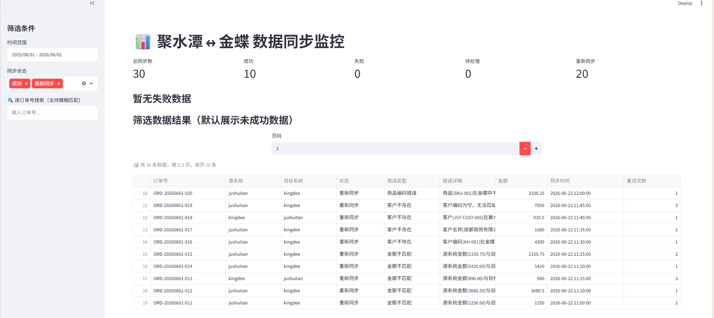
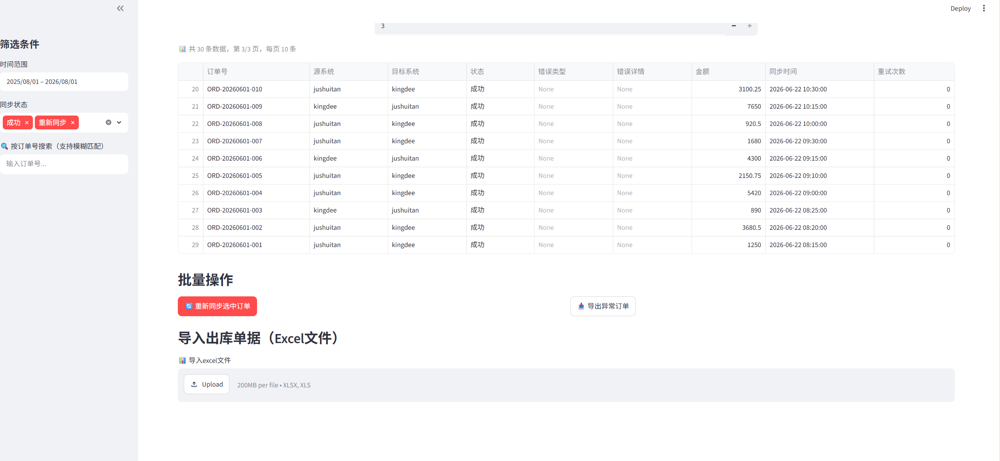

# ERP 数据同步监控系统

> 电商 ERP（聚水潭 ↔ 金蝶）多系统数据同步的可视化监控与运维工具（示例项目，数据均为脱敏样例）。





## 项目背景

多系统之间的数据同步任务链路长、任务量大，人工排查成本高。本项目提供一套轻量可视化方案：实时掌握同步状态、快速定位异常订单、一键批量重推、Excel 批量导入导出，把"数据运维"从人工翻数据库变成看板操作。

## 功能

- **监控看板（Streamlit）**：成功/失败/待处理/重新同步状态统计卡片、失败原因汇总图表、异常订单列表（时间范围 / 订单号 / 状态多维筛选、分页）
- **批量运维**：一键将失败/待处理订单标记为「重新同步」、异常订单 CSV 导出
- **Excel 批量导入**：字段映射（中文表头 → 数据库字段）、类型转换、`ON CONFLICT` 冲突更新、分批写入 + 进度条
- **查询服务（FastAPI + SQLAlchemy）**：出库单据列表查询（多条件组合筛选、分页）、订单统计（按状态/来源系统分组）
- **性能优化**：看板统计数据 `@st.cache_data(ttl=60)` 缓存，大表查询通过索引与分页保障响应

## 技术栈

Python · Streamlit · FastAPI · SQLAlchemy ORM · PostgreSQL · pandas · openpyxl

## 目录结构

```
├── stDemo.py              # Streamlit 监控看板（入口）
├── erp_api/
│   ├── main.py            # FastAPI 应用入口
│   ├── models/database.py # SQLAlchemy 模型与数据库会话
│   ├── routers/saleout.py # 出库单据查询 / 统计接口
│   └── schemas/query.py   # 请求/响应模型
├── init_data.sql          # PostgreSQL 建表语句与样例数据（脱敏）
├── requirements.txt
└── .env.example           # 数据库配置模板
```

## 快速开始

1. 初始化数据库（PostgreSQL）
   ```bash
   psql -U postgres -d erp -f init_data.sql
   ```
2. 配置数据库连接
   ```bash
   cp .env.example .env   # 编辑 .env，填入本地数据库连接串 DB_URL
   ```
3. 安装依赖并启动看板
   ```bash
   pip install -r requirements.txt
   streamlit run stDemo.py
   ```
4. （可选）启动查询服务
   ```bash
   uvicorn erp_api.main:app --reload --port 8000
   # 接口文档：http://localhost:8000/docs
   ```

## 说明

- 本项目为个人学习/作品项目，数据库密码等敏感信息通过 `.env` 配置，**不提交到代码库**；仓库内所有业务数据均为脱敏样例。
- 数据结构与核心思路源自电商 ERP 多系统（聚水潭/金蝶/用友/鼎捷等）数据同步的监控与对账场景。
